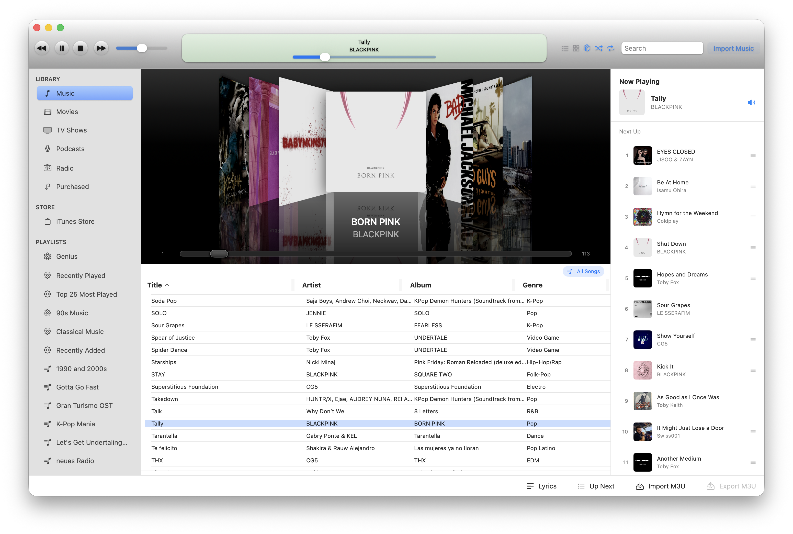
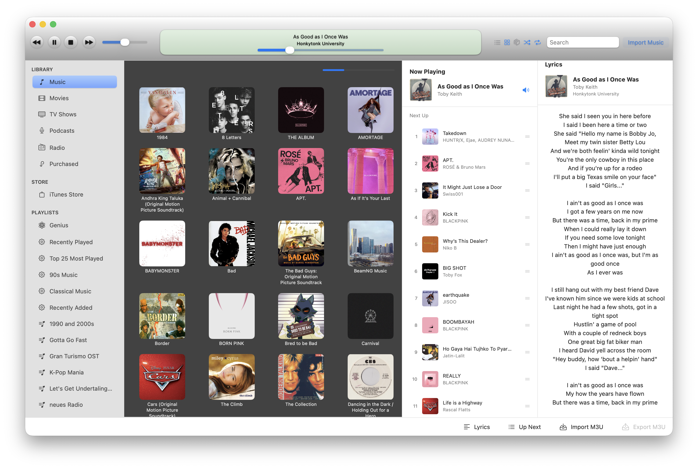
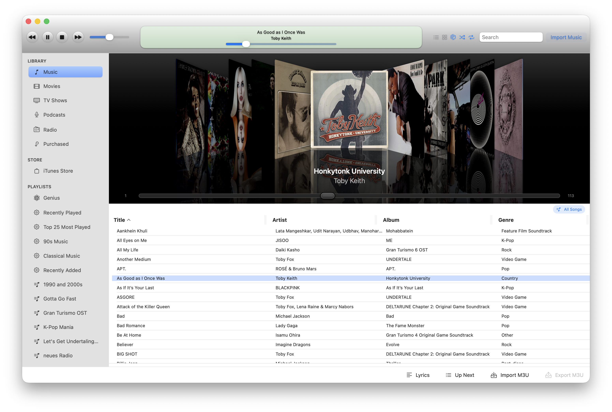
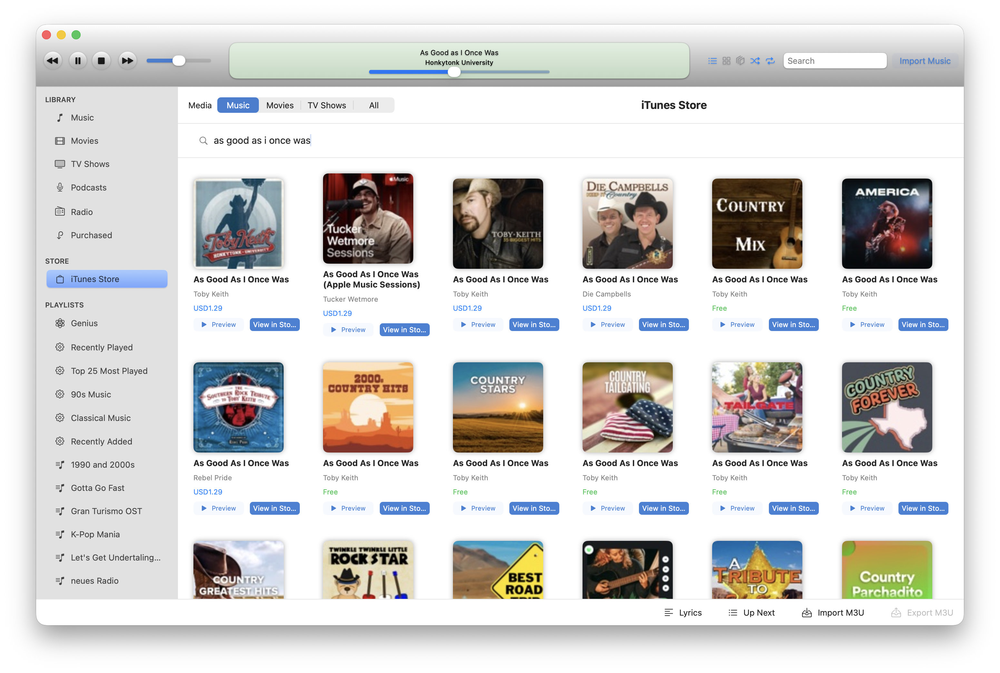
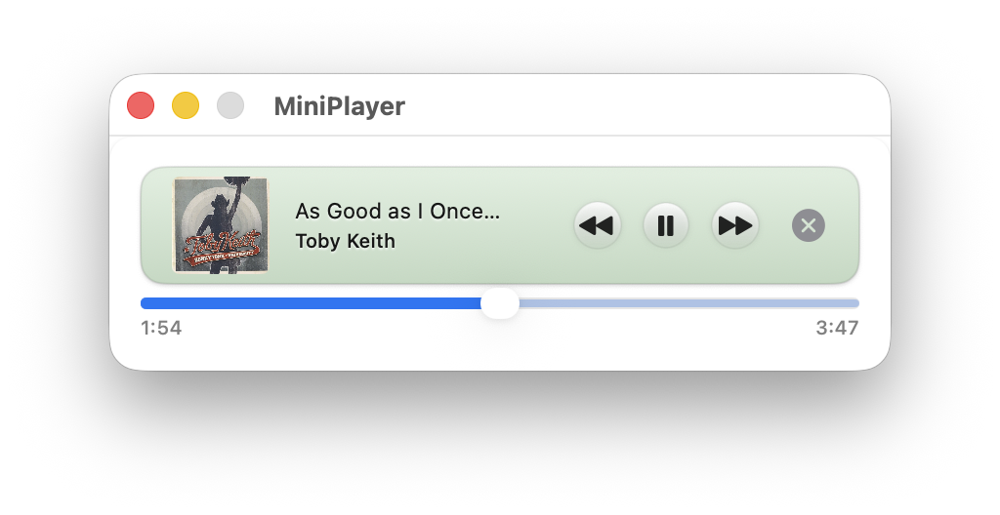

# ClassicTunes

After the UI overhaul of the Music app in macOS 26 diverged from the long-standing iTunes design language, I tried to use older iTunes versions on a modern MacBook because I preferred its design and feature set. However, starting with Tahoe, most solutions for running older software began to break due to the deprecation of certain libraries. As such, I decided to make my own music player completely from scratch using Swift and SwiftUI.

**ClassicTunes** is an Apple Silicon–made app that emulates the classic designs of iTunes 7–10, featuring:

- Working Cover Flow
- MiniPlayer
- Playlists (with smart m3u support)
- iTunes Store integration
- Lyrics support (with lrclib or metadata)
- Discord Rich Presence (with MusicPresence)
- Classic iTunes 7–10 aesthetics

I ran out of things to say.

## Screenshots

